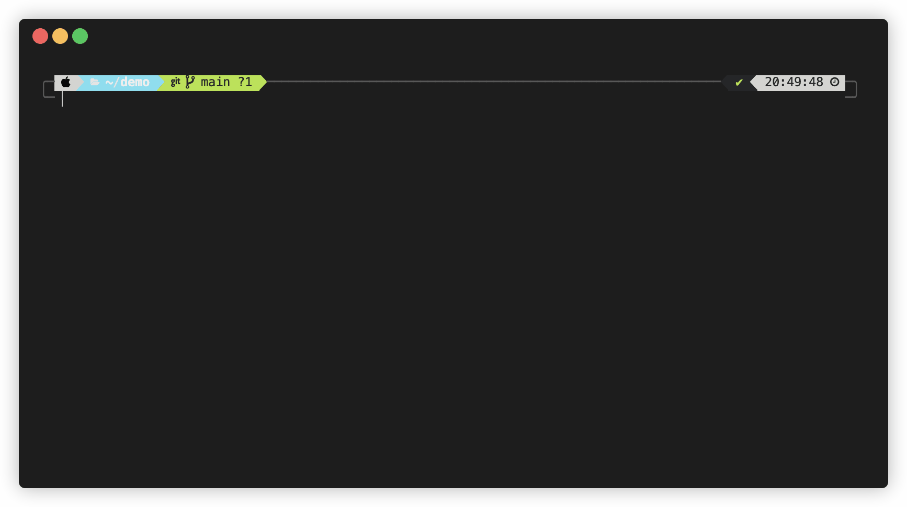

<p align="center">
  
</p>


[](https://deno.land/x/cocli)




A ligthweight git commit prompt system to ensure readable and descriptive commit for Deno 🦕🌱

## Installation

```shell
deno install -A -r -g https://deno.land/x/cocli/cli.ts -n cocli
```

## Quick Start

```shell
deno run -A -r https://deno.land/x/cocli/cli.ts
```

## Commit Type

List of type available:

- Feat - For new features (e.g., feat: implement --cache-to feature to export cache)
- Fix - For improvements and bugfixes that do not introduce a feature (e.g., fix: improve error message)
- Hotfix - For improvements and bugfixes that do not introduce a feature, directly in production mode (e.g., fix: improve success message)
- Chore - General things that should be excluded (e.g., chore: clean up X)
- Design - For design changes only (e.g., design: use rounded button)
- Experiment - General things that should be in experiment (e.g., experiment: implement new query system in X)
- Docs - For documentation changes only (e.g., docs: fix typo in X)
- Refactor - General things that should be restructured but not changing the original functionality (e.g., refactor: move X to new file utils)
- CI - For internal CI specific changes (e.g., ci: enable X for tests)
- Infra - For infrastructure changes (e.g., infra: Enable cloudfront for X)
- Test - For changes to tests only (e.g., test: check if X does Y)

## LICENSE

This project is licensed under the MIT License - see the [LICENSE](LICENSE) file for details.
